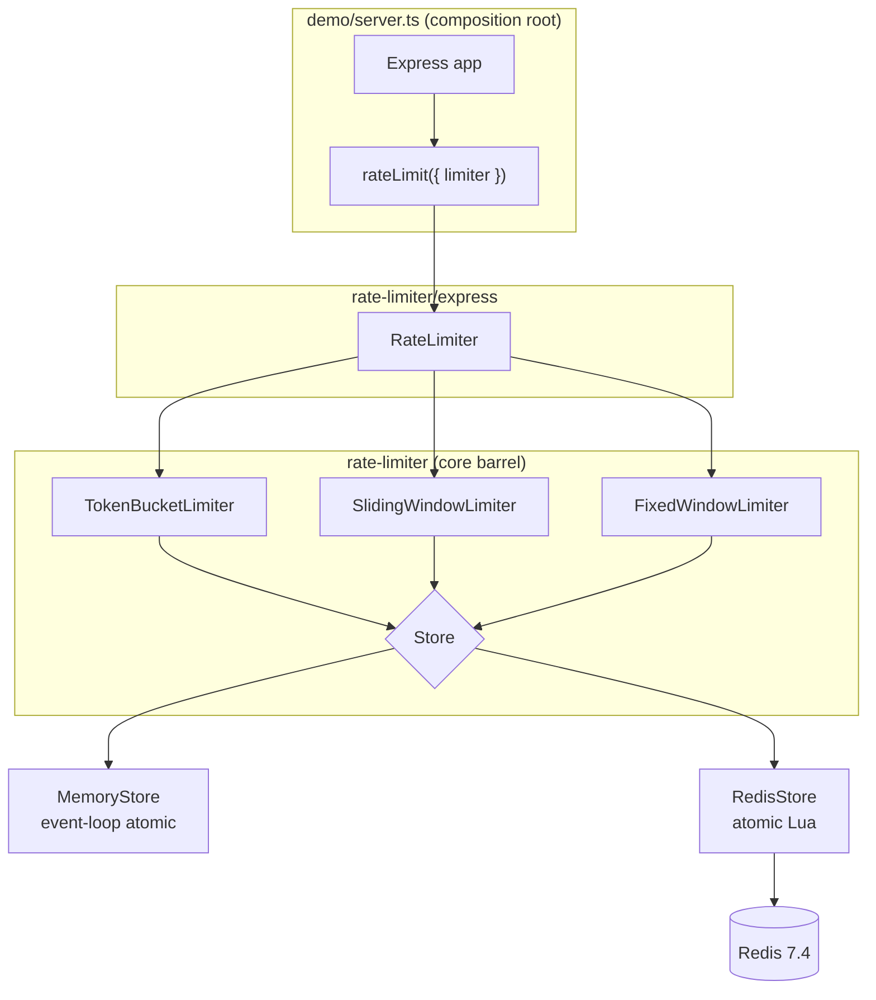
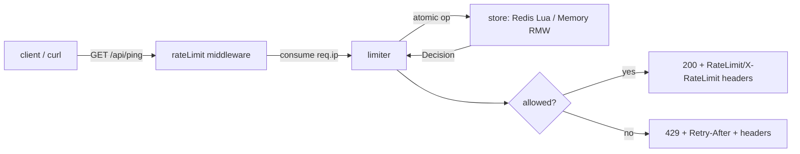

# Phase 4: Demo, Docker & DESIGN.md - Research

**Researched:** 2026-06-25
**Domain:** Application composition (Express 5 demo server) + container packaging (Docker multi-stage + Compose v2) + graded systems-design documentation (DESIGN.md / README / Mermaid)
**Confidence:** HIGH

## Summary

Phase 4 writes **no new algorithm, store, or middleware logic**. Everything functional is built, tested, and exported: the core barrel (`rate-limiter` → `RedisStore`, `MemoryStore`, three limiters, `SystemClock`) and the Express adapter subpath (`rate-limiter/express` → `rateLimit()`). This phase is pure **composition + Docker + documentation**. The technical surface is therefore small and well-understood — the work is wiring an idiomatic Express 5 demo server, authoring a correct multi-stage `node:24-alpine` Dockerfile + Compose v2 file, adding a single `verify` script, and narrating already-locked trade-offs into DESIGN.md/README with Mermaid diagrams.

The single most important discovery for the demo: `RedisStore.connect(connection?, config?, clock?)` is a **batteries-included static factory** that builds a correctly-configured ioredis client (commandTimeout, `maxRetriesPerRequest:1`, `enableOfflineQueue:false`, `lazyConnect:true`) and returns a ready `RedisStore`. The demo's store-selection (D4-01) is a one-line branch: `REDIS_URL ? RedisStore.connect(REDIS_URL) : new MemoryStore()`. Each limiter is a thin `new XxxLimiter(store, config)`; the adapter is `rateLimit({ limiter })` with zero other options (D4-04 leans on defaults).

**Primary recommendation:** Put the demo at `rate-limiter/src/demo/server.ts` (a new top tier that may import `rate-limiter/express` and the core barrel, but must NOT be added to `src/index.ts`). Run it via `tsx` in dev and built `dist/demo/server.js` in the runtime image (add `src/demo/server.ts` as a third tsup entry). Build the Dockerfile as two stages on `node:24-alpine`, run as the image's built-in non-root `node` user, set `init: true` in Compose for signal handling, and have the demo install a SIGTERM handler that closes the HTTP server (and the RedisStore client). `verify` = `tsc --noEmit && vitest run` with Docker documented as a hard prerequisite (D4-06, no auto-skip change needed — see §verify).

<phase_requirements>
## Phase Requirements

| ID | Description | Research Support |
|----|-------------|------------------|
| DELIV-01 | A demo HTTP server exercises the middleware end-to-end | §Standard Stack (existing API surface), §Architecture Patterns (Pattern 1: store selection, Pattern 2: demo server shape), §Code Examples (server.ts) |
| DELIV-02 | One command (`docker compose up`) starts demo + Redis — multi-stage `node:24-alpine` non-root Dockerfile + Compose with Redis service + healthcheck, no manual setup | §Architecture Patterns (Pattern 3: Dockerfile, Pattern 4: compose), §Don't Hand-Roll (signal handling, wait-for-it), §Common Pitfalls |
| DELIV-03 | `npm run verify` (typecheck + full suite) passes from a clean checkout, enforced as a gate | §verify script analysis, §Environment Availability (Docker daemon required) |
| DELIV-04 | `DESIGN.md` documents architecture, trade-offs, honest AI-usage section | §DESIGN.md content map (trade-off source-of-truth table) |
| DELIV-06 | Score-boosting docs — README quickstart + example requests + Mermaid diagrams | §README + Mermaid (diagrams, curl examples) |

DELIV-05 (`/rate-limiter` folder) is already satisfied; all new files land under `rate-limiter/`.
</phase_requirements>

<user_constraints>
## User Constraints (from CONTEXT.md)

### Locked Decisions
- **D4-01:** Demo store = `RedisStore` when `REDIS_URL` is set, auto-fallback to `MemoryStore` when absent (runs with zero Docker standalone). Under compose, exercises the real distributed Redis path.
- **D4-02:** Demo defaults to the **Token Bucket** limiter, switchable via an env var across all three algorithms (`token-bucket | sliding-window | fixed-window`). Concrete env name + small default config is Claude's discretion; keep numbers tiny so a 429 is easy to trigger.
- **D4-03:** Two routes — (a) rate-limited `GET /api/ping` (exact path discretionary) at a tiny limit (~5/min) so 429 + Retry-After + rate-limit headers are trivial to reproduce; (b) **unlimited** `GET /health` returning 200 for the compose app healthcheck (NOT behind the limiter).
- **D4-04:** Demo relies on the middleware's out-of-the-box defaults — `rateLimit({ limiter })` → IP key, both header families, fail-open, JSON 429 (Phase 3 D3-09/D3-10). Wires limiter + store and otherwise leans on defaults; intentionally minimal.
- **D4-05:** `docker compose up` = two services: `app` (multi-stage `node:24-alpine`, **non-root**, runs demo server) and `redis` (`redis:7.4-alpine`) on a shared network. Redis has a healthcheck; `app` waits via `depends_on: condition: service_healthy` and receives `REDIS_URL`. Multi-stage: build stage runs `tsup`; runtime stage copies `dist` + production deps only.
- **D4-06:** `npm run verify` = typecheck + the FULL test suite, with Docker as a **documented, required prerequisite** (no auto-skip). The testcontainers Redis integration tests run unconditionally. README/DESIGN.md MUST state a running Docker daemon is required for `npm run verify`. Planner note: confirm/define a `verify` script (`typecheck` + `test` exist; `verify` does not yet).
- **D4-07:** README = reader-facing quickstart (one-command `docker compose up`), curl examples showing a 200 then a 429 with Retry-After / rate-limit headers, the Docker-required note for `npm run verify`, and the **Mermaid architecture/data-flow diagram**. DESIGN.md = grader-facing depth: architecture overview, locked trade-offs (why atomic Lua, fixed-window boundary behavior, concurrency justification, fail-open vs fail-closed rationale, delta-seconds reset-header convention from D3-05), and an **honest AI-usage section**.
- **D4-08:** AI-usage section is honest and specific — discloses the project was built with AI assistance (Claude Code / GSD workflow), what AI did vs what was human-directed, where AI output was reviewed/corrected. A candid disclosure, not marketing. (DELIV-04 explicitly grades this.)

### Claude's Discretion
- Exact demo route path(s) (`/api/ping` vs other), precise demo limit numbers + window, env var names (algorithm selector, limit overrides), and the small demo limiter config — keep numbers tiny so a 429 is easy to show.
- Demo server file location and shape under `rate-limiter/` (e.g. `src/demo/server.ts` or top-level `demo/`), and whether it gets its own `tsx` `dev` script + a thin supertest smoke test. Keep Express usage inside the adapter/demo tier — do NOT pull Express into the core barrel.
- Dockerfile layering details (cache mounts, prune strategy), compose file name, healthcheck commands/intervals, exposed port — standard Docker craft per CLAUDE.md Docker posture.
- Whether a thin root-level `README` pointer is added in addition to `rate-limiter/README.md` — canonical docs live under `/rate-limiter` (DELIV-05); a root pointer is optional polish.
- DESIGN.md section ordering and the exact Mermaid diagram(s) — as long as the layered design (core → store/adapter → demo) and the request path (client → middleware → limiter → store → decision → headers/429) are legible.

### Deferred Ideas (OUT OF SCOPE)
- Metrics / `/metrics` Prometheus endpoint (prom-client) and structured decision logging — OBS-01/02, v2. The demo does NOT build a metrics dashboard.
- Variable request `cost` through the demo / middleware — EXT-01, v2.
- A second framework adapter (Fastify, etc.) — EXT-02, v2.
- A richer multi-route demo (per-key vs per-IP, multiple limiters side by side) — rejected in favor of the minimal two-route demo (D4-03).
</user_constraints>

## Project Constraints (from CLAUDE.md)

These directives have the same authority as locked decisions. Research must not contradict them.

- **Runtime:** Node.js **24.x** (Active LTS "Krypton"). Docker base `node:24-alpine`; `.nvmrc` pins `24`. Do NOT use Node 20/22 base images or `:latest` tags anywhere.
- **Redis image:** `redis:7.4-alpine` (pinned, never `:latest`) for compose + tests.
- **Build:** `tsup` (locked — tsdown migration declined). **Run:** `tsx` for dev/demo; the runtime image runs built `dist`, NOT `tsx` (do not ship `tsx` in the runtime image).
- **Docker (prescriptive):** `node:24-alpine` multi-stage; build stage runs `tsup`; runtime stage copies `dist` + production deps only, runs **non-root**, has a `HEALTHCHECK`. Compose = two services (`app` + `redis:7.4-alpine`) on a shared network with a Redis healthcheck.
- **What NOT to Use:** no `ioredis-mock`; no off-the-shelf limiter (`express-rate-limit`, `rate-limiter-flexible`); no `node-redis` (ioredis is mandated); no ESLint legacy `.eslintrc` (flat config only); no `ts-node`; no Express 4; no Winston/heavy logging; no `:latest` tags. **pino/prom-client are nice-to-haves only and are OUT OF SCOPE this phase** (OBS-* deferred).
- **Quality gate:** code must build and all tests must pass at every milestone (the `tsc --noEmit` + full Vitest gate — this is exactly what `verify` formalizes).
- **APOSD posture:** favor clarity and deep modules over feature breadth; avoid overengineering / AI slop (graded).

## Architectural Responsibility Map

| Capability | Primary Tier | Secondary Tier | Rationale |
|------------|-------------|----------------|-----------|
| Store selection (Redis vs Memory by env) | Demo server (`src/demo/server.ts`) | — | Composition root: only the demo reads `REDIS_URL` and decides which store to instantiate. Core stays env-agnostic. |
| Limiter construction (algorithm + config) | Demo server | Core (limiter classes) | Demo picks the algorithm from env (D4-02) and constructs the matching limiter; the limiter classes themselves live in core. |
| Key extraction (per-IP) | Express adapter (`rateLimit` default `req.ip`) | — | Locked in Phase 3 (D3-01); demo leans on the default (D4-04). |
| 429 / Retry-After / rate-limit headers | Express adapter | — | Locked in Phase 3; demo does not touch header logic. |
| Atomic enforcement under concurrency | Store tier (Redis Lua / Memory event-loop) | — | Locked in Phases 1–2; demo does not touch. |
| HTTP routing (`/api/ping`, `/health`) | Demo server | — | Demo-only; `/health` is deliberately NOT behind the limiter (D4-03). |
| Process lifecycle (listen, SIGTERM, store close) | Demo server | — | Composition root owns the server lifecycle and graceful shutdown. |
| Container build / runtime / non-root / healthcheck | Dockerfile | Compose (orchestration, network, env, depends_on) | Standard tier split: image builds the artifact; compose wires services together. |

**Tier boundary rule (locked, STATE.md / Phase 3):** only `src/store/redis.ts` imports `ioredis`; only `src/adapters/express/**` imports Express. The demo server is a **new top tier** that may import both (Express via the `rate-limiter/express` subpath, the store via the core barrel) — but `src/index.ts` (the core barrel) must stay Express-free and demo-free.

## Standard Stack

No new runtime dependencies are required. The phase composes existing exports and adds Docker/doc files. The only `package.json` change is scripts (+ a third tsup entry for the demo).

### Existing API surface the demo composes (VERIFIED by reading source)

| Symbol | Import from | Signature / shape | Source |
|--------|-------------|-------------------|--------|
| `RedisStore.connect` | `rate-limiter` | `static connect(connection?: string, config?: Partial<RedisStoreConfig>, clock?: Clock): RedisStore` — builds a defensive ioredis client (`commandTimeout`, `maxRetriesPerRequest:1`, `enableOfflineQueue:false`, `lazyConnect:true`) and returns a ready store | `src/store/redis.ts:116` [VERIFIED: codebase] |
| `RedisStore#close` | `rate-limiter` | `close(): Promise<void>` — quits the client with a 1s timeout then force-disconnects; use in SIGTERM handler | `src/store/redis.ts:160` [VERIFIED: codebase] |
| `MemoryStore` | `rate-limiter` | `new MemoryStore()` — no-arg in-memory reference store | `src/store/memory.ts` [VERIFIED: codebase] |
| `TokenBucketLimiter` | `rate-limiter` | `new TokenBucketLimiter(store, cfg: { capacity, refillPerInterval, intervalMs }, clock?)` | `src/limiters/token-bucket.ts:12` [VERIFIED: codebase] |
| `SlidingWindowLimiter` | `rate-limiter` | `new SlidingWindowLimiter(store, cfg: { limit, windowMs }, clock?)` | `src/limiters/sliding-window.ts:12` [VERIFIED: codebase] |
| `FixedWindowLimiter` | `rate-limiter` | `new FixedWindowLimiter(store, cfg: { limit, windowMs }, clock?)` | `src/limiters/fixed-window.ts:12` [VERIFIED: codebase] |
| `rateLimit` | `rate-limiter/express` | `rateLimit(options: { limiter, keyGenerator?, policy?, headers?, windowSeconds?, handler?, message?, logger? }): RequestHandler` — only `limiter` is required | `src/adapters/express/middleware.ts:65` [VERIFIED: codebase] |
| `SystemClock` | `rate-limiter` | default real clock (limiters default to it; demo can omit) | `src/index.ts:22` [VERIFIED: codebase] |

**Config-field note (avoid a common slip):** Token Bucket config is `{ capacity, refillPerInterval, intervalMs }` (NOT `{ limit, windowMs }`); the two window algorithms use `{ limit, windowMs }`. A tiny demo for an easy 429: Token Bucket `{ capacity: 5, refillPerInterval: 5, intervalMs: 60_000 }` (5 req burst, refills 5 every 60s ≈ "5/min"); windows `{ limit: 5, windowMs: 60_000 }`. [VERIFIED: codebase — src/types.ts:66/73]

### Dev tooling (already installed — no new installs)
| Tool | Version (installed) | Use this phase | Source |
|------|--------------------|----------------|--------|
| tsup | ^8.5.1 | Add `src/demo/server.ts` as a third entry so `dist/demo/server.js` is built for the runtime image | `package.json` [VERIFIED: codebase] |
| tsx | (CLAUDE.md ^4.22 — **NOT in package.json devDeps yet**) | Run the demo in dev without a build | see Open Question 1 |
| express | ^5.2.1 (devDep + peer `>=5`) | The demo imports Express directly (it is a NEW top tier) | `package.json` [VERIFIED: codebase] |
| supertest | ^7.2.2 | Optional thin smoke test for the demo server | `package.json` [VERIFIED: codebase] |
| vitest | ^4.1.9 | `verify`'s test runner | `package.json` [VERIFIED: codebase] |
| typescript | ~5.9 | `verify`'s typecheck (`tsc --noEmit`) | `package.json` [VERIFIED: codebase] |

### Alternatives Considered
| Instead of | Could Use | Tradeoff |
|------------|-----------|----------|
| Demo at `src/demo/server.ts` (3rd tsup entry) | Top-level `demo/server.ts` outside `src/` | A separate dir needs its own build/tsconfig include wiring; keeping it under `src/` reuses the existing tsup + tsconfig include (`["src","test",...]`) with one extra entry. Recommend `src/demo/`. |
| `init: true` in compose (Compose-managed tini) | `ENTRYPOINT ["/sbin/tini","--"]` in the Dockerfile | Both forward SIGTERM and reap zombies. `node:*-alpine` ships tini at `/sbin/tini`. `init: true` is the smaller, declarative Compose option; the Dockerfile ENTRYPOINT is more portable to `docker run` without `--init`. Either satisfies graceful shutdown; pick one (do not need both). |
| `RedisStore.connect(REDIS_URL)` (batteries-included) | Hand-build an ioredis client + `new RedisStore(client, ...)` | `connect()` already sets the defensive options correctly; hand-building risks omitting `enableOfflineQueue:false`/timeout and reads as redundant. Use `connect()`. |

**Installation:** No runtime packages to install. If using `tsx` for the dev script, add it as a devDep (see Open Question 1):
```bash
npm install --save-dev tsx@^4.22   # verify on the npm registry first; see Package Legitimacy Audit
```

**Version verification:** Installed versions read directly from `rate-limiter/package.json` (no registry round-trip needed — these are already in the lockfile). `tsx` is the only candidate new package; verify before install.

## Package Legitimacy Audit

> Only ONE package is a candidate for new install this phase: `tsx` (dev-only, for the demo `dev` script). All other dependencies already exist in the lockfile and were vetted in earlier phases.

slopcheck was not run in this session (no network install attempted for a doc-research pass). Per the graceful-degradation rule, the one candidate package is tagged `[ASSUMED]` and the planner should gate its install behind a `checkpoint:human-verify` (or simply confirm it against the npm registry with `npm view tsx version`).

| Package | Registry | Age | Downloads | Source Repo | slopcheck | Disposition |
|---------|----------|-----|-----------|-------------|-----------|-------------|
| `tsx` | npm | well-established (years) | very high (millions/wk) | github.com/privatera/tsx (esbuild-kit lineage) | not run | `[ASSUMED]` — verify with `npm view tsx version` before install; CLAUDE.md already prescribes tsx ^4.22 |

**Packages removed due to slopcheck [SLOP] verdict:** none
**Packages flagged as suspicious [SUS]:** none

*`tsx` is explicitly prescribed by CLAUDE.md's stack table (^4.22.4, "verified" on 2026-06-23). The `[ASSUMED]` tag here is procedural (slopcheck not run this session), not a doubt about the package. Planner: a one-line `npm view tsx version` confirmation is sufficient.*

## Architecture Patterns

### System Architecture Diagram

```
docker compose up
        │
        ├─────────────► [ redis service ]  redis:7.4-alpine
        │                     ▲   healthcheck: redis-cli ping → PONG
        │                     │   (app depends_on: condition: service_healthy)
        │                     │
        └──► [ app service ]  node:24-alpine (non-root, init:true)
                  │           env: REDIS_URL=redis://redis:6379, RL_ALGO, PORT
                  │
                  ▼
        ┌───────────────────────── demo/server.ts (composition root) ──────────────────────┐
        │                                                                                    │
        │  REDIS_URL set? ── yes ──► RedisStore.connect(REDIS_URL)  ──┐                       │
        │            │                                                ├─► store               │
        │            └─ no ───────► new MemoryStore()  ───────────────┘                       │
        │                                                                                    │
        │  RL_ALGO ──► new {TokenBucket|SlidingWindow|FixedWindow}Limiter(store, cfg) ─► limiter│
        │                                                                                    │
        │  app.get('/health', 200)              ◄── NOT rate-limited (compose healthcheck)   │
        │  app.use(rateLimit({ limiter }))      ◄── per-IP, both header families, fail-open  │
        │  app.get('/api/ping', 200)            ◄── rate-limited                             │
        └───────────────────────────────────────────────────────────────────────────────────┘
                  │
   client ──HTTP──┤
   (curl)         ▼
        GET /api/ping
           │
           ▼
   rateLimit middleware ──► limiter.consume(req.ip)
           │                      │
           │                      ▼
           │                store op (atomic): Redis Lua EVALSHA  OR  Memory event-loop RMW
           │                      │
           │                      ▼  Decision { allowed, limit, remaining, resetMs, retryAfterMs }
           ▼
   allowed? ── yes ─► next() ─► 200 ping  (+ RateLimit / X-RateLimit-* headers)
            └─ no ──► 429 JSON + Retry-After + RateLimit / X-RateLimit-* headers
```

### Recommended Project Structure
```
rate-limiter/
├── src/
│   ├── index.ts              # core barrel — STAYS Express/demo-free
│   ├── adapters/express/     # rateLimit() — only tier that imports Express
│   ├── store/                # redis.ts (only ioredis importer) + memory.ts + lua/
│   ├── limiters/             # three limiter classes
│   └── demo/
│       └── server.ts         # NEW — composition root; 3rd tsup entry
├── test/
│   └── demo.test.ts          # OPTIONAL thin supertest smoke (discretionary)
├── Dockerfile                # NEW — multi-stage node:24-alpine, non-root
├── .dockerignore             # NEW
├── docker-compose.yml        # NEW — app + redis, healthcheck, depends_on
├── README.md                 # NEW — quickstart + curl + Mermaid
├── DESIGN.md                 # NEW — architecture + trade-offs + AI-usage
└── package.json              # +verify, +dev/start scripts; tsup +demo entry
```

### Pattern 1: Env-driven store + limiter selection (the composition root)
**What:** A single function reads env once, builds the store (D4-01) and limiter (D4-02), and returns the `RateLimiter` the middleware enforces.
**When to use:** Exactly once, at server startup. Fail loud on a bad `RL_ALGO` value (consistent with the codebase's construct-time validation).
**Example:**
```typescript
// Source: composed from VERIFIED signatures in src/store/redis.ts, src/limiters/*, src/index.ts
import {
  RedisStore, MemoryStore,
  TokenBucketLimiter, SlidingWindowLimiter, FixedWindowLimiter,
  type RateLimiter, type Store,
} from 'rate-limiter';

function buildStore(): { store: Store; close: () => Promise<void> } {
  const url = process.env.REDIS_URL;
  if (url) {
    const store = RedisStore.connect(url);            // D4-01: real distributed path
    return { store, close: () => store.close() };      // close in SIGTERM
  }
  return { store: new MemoryStore(), close: async () => {} }; // zero-Docker fallback
}

function buildLimiter(store: Store): RateLimiter {
  const algo = process.env.RL_ALGO ?? 'token-bucket'; // D4-02 default
  const win = { limit: 5, windowMs: 60_000 };          // tiny → easy 429 (D4-03)
  switch (algo) {
    case 'token-bucket':
      return new TokenBucketLimiter(store, { capacity: 5, refillPerInterval: 5, intervalMs: 60_000 });
    case 'sliding-window': return new SlidingWindowLimiter(store, win);
    case 'fixed-window':   return new FixedWindowLimiter(store, win);
    default: throw new RangeError(`RL_ALGO must be token-bucket|sliding-window|fixed-window, got "${algo}"`);
  }
}
```

### Pattern 2: Health route OUTSIDE the limiter, ping route INSIDE (D4-03)
**What:** Register `/health` before `app.use(rateLimit(...))` so it is never throttled; mount the limiter middleware after, so only routes registered after it (e.g. `/api/ping`) are limited.
**Why it matters:** If `/health` were behind the limiter, the compose healthcheck would consume budget and could itself receive a 429 → the container would flap unhealthy. Express runs middleware in registration order, so route-then-`use`-then-route ordering is the lever.
```typescript
const app = express();
app.get('/health', (_req, res) => res.status(200).json({ status: 'ok' })); // unlimited
app.use(rateLimit({ limiter }));                                            // D4-04 defaults
app.get('/api/ping', (_req, res) => res.status(200).json({ pong: true })); // limited
```
**Note (trust proxy):** behind a proxy, `req.ip` needs Express `trust proxy` to be correct (Phase 3 D3-02). The demo runs directly (no proxy) under compose, so default `req.ip` is fine — but DESIGN.md/README should mention this as a deployment note.

### Pattern 3: Graceful shutdown (SIGTERM) — composition root owns lifecycle
**What:** On SIGTERM (what `docker stop` / compose down sends), stop accepting connections, then close the store client, then exit.
```typescript
const server = app.listen(port, () => log(`listening on ${port}`));
const shutdown = async (sig: string) => {
  server.close(async () => { await close(); process.exit(0); });
  // safety net: force exit if close hangs
  setTimeout(() => process.exit(1), 5_000).unref();
};
process.on('SIGTERM', () => void shutdown('SIGTERM'));
process.on('SIGINT', () => void shutdown('SIGINT'));
```
**Pair with `init: true` (Compose) or tini in the Dockerfile** so Node actually receives SIGTERM as PID 1 (see Pitfall 1).

### Pattern 4: Multi-stage Dockerfile (node:24-alpine, non-root)
**What:** Build stage installs all deps + runs `tsup`; runtime stage installs prod deps only, copies `dist`, runs as the built-in `node` user with a `HEALTHCHECK` on `/health`.
```dockerfile
# Source: pattern verified against Docker/Node best-practice search (2025-2026) + CLAUDE.md posture
# ---- build stage ----
FROM node:24-alpine AS build
WORKDIR /app
COPY package.json package-lock.json ./
RUN npm ci                       # all deps (tsup is a devDep)
COPY . .
RUN npm run build                # tsup → dist/ (incl. dist/demo/server.js + lua copy)

# ---- runtime stage ----
FROM node:24-alpine AS runtime
ENV NODE_ENV=production
WORKDIR /app
COPY package.json package-lock.json ./
RUN npm ci --omit=dev            # production deps only (ioredis)
COPY --from=build /app/dist ./dist
USER node                        # built-in non-root user (D4-05 / CLAUDE.md)
EXPOSE 3000
HEALTHCHECK --interval=10s --timeout=3s --start-period=5s --retries=3 \
  CMD node -e "fetch('http://localhost:3000/health').then(r=>process.exit(r.ok?0:1)).catch(()=>process.exit(1))"
CMD ["node", "dist/demo/server.js"]   # exec form → node is PID 1 (use init:true in compose)
```
**Notes:** Node 24 has global `fetch`, so the HEALTHCHECK needs no curl/wget (Alpine ships neither by default) [VERIFIED: Node 18+ ships undici fetch — CITED training + nodejs.org]. `npm ci` requires `package-lock.json` to exist — confirm it is committed (see Open Question 2). `.dockerignore` must exclude `node_modules`, `dist`, `.git`, `test`, `*.md` to keep the build context small and avoid copying host `node_modules`.

### Pattern 5: docker-compose.yml (Compose v2, no `version:` key)
**What:** Two services on the default project network; Redis healthcheck gates the app start.
```yaml
# Source: VERIFIED via Docker docs + web search (2025-2026); redis:7.4-alpine pinned per CLAUDE.md
services:
  redis:
    image: redis:7.4-alpine
    healthcheck:
      test: ["CMD", "redis-cli", "ping"]
      interval: 5s
      timeout: 3s
      retries: 5
  app:
    build: .
    init: true                       # PID-1 signal forwarding (graceful shutdown)
    environment:
      REDIS_URL: redis://redis:6379  # D4-01: real distributed path under compose
      PORT: "3000"
    ports:
      - "3000:3000"
    depends_on:
      redis:
        condition: service_healthy   # D4-05: wait for Redis PONG, not just start
```
**Compose v2 note:** the top-level `version:` key is **obsolete** in Compose v2 and emits a warning if present — omit it. [VERIFIED: Docker docs + web search 2025-2026]

### Anti-Patterns to Avoid
- **`/health` behind the limiter** → healthcheck flaps (Pattern 2 fixes this).
- **`depends_on: [redis]` without `condition: service_healthy`** → app starts before Redis accepts connections; first requests hit a not-yet-ready Redis. Use the healthcheck condition (D4-05).
- **Shell-form `CMD node dist/demo/server.js`** → a shell becomes PID 1 and does NOT forward SIGTERM; graceful shutdown never runs. Use exec-form `CMD ["node", ...]` + `init:true`/tini.
- **Running as root** → violates D4-05/CLAUDE.md; `USER node` in the runtime stage.
- **`:latest` tags** → CLAUDE.md forbids; pin `node:24-alpine`, `redis:7.4-alpine`.
- **Shipping `tsx`/devDeps in the runtime image** → CLAUDE.md: runtime runs built `dist`, prod deps only.

## Don't Hand-Roll

| Problem | Don't Build | Use Instead | Why |
|---------|-------------|-------------|-----|
| Wait for Redis to be ready before app starts | A `wait-for-it.sh` / sleep loop in an entrypoint | Compose `depends_on: { redis: { condition: service_healthy } }` + Redis healthcheck | Compose-native; no extra script, no race; the documented modern pattern (D4-05). |
| PID-1 signal forwarding / zombie reaping | Custom bash wrapper / `dumb-init` install | `init: true` in compose OR `/sbin/tini` (already in node alpine) | Built-in; correct SIGTERM forwarding for graceful shutdown. |
| Defensive ioredis client construction | Hand-set timeout/offline-queue/retries | `RedisStore.connect(REDIS_URL)` | Already sets the correct defensive options (VERIFIED src/store/redis.ts). |
| Rate-limit decision / headers / 429 | Any new limiter or header code | Existing `rateLimit({ limiter })` + the three limiter classes | This phase writes NO new algorithm/store/middleware logic (phase boundary). |
| HTTP healthcheck client in Alpine | Install curl/wget | `node -e "fetch(...)"` | Node 24 has global fetch; no extra package or apk install. |

**Key insight:** Almost every "hard" part of this phase is already solved by an existing export or a Compose/Docker-native feature. The failure mode for this phase is *adding* code (slop) where composition suffices — the rubric penalizes overengineering.

## Common Pitfalls

### Pitfall 1: Node as PID 1 ignores SIGTERM (no graceful shutdown)
**What goes wrong:** `docker stop` / `compose down` sends SIGTERM; with shell-form CMD or no init, the signal is swallowed, in-flight requests are cut, and the Redis client is never closed.
**Why it happens:** A shell becomes PID 1 and doesn't forward signals; or Node-as-PID-1 has no default SIGTERM handler that exits.
**How to avoid:** Exec-form `CMD ["node","dist/demo/server.js"]` + `init: true` in compose (or tini ENTRYPOINT) + an explicit `process.on('SIGTERM', ...)` that `server.close()` then `store.close()`.
**Warning signs:** `docker compose down` hangs ~10s (the default stop grace) before force-kill.

### Pitfall 2: `verify` fails on a clean checkout because Docker isn't running
**What goes wrong:** The full Vitest suite includes testcontainers Redis tests. The harness `dockerAvailable()` uses `describe.skipIf(!dockerAvailable())` — so with **no Docker daemon, those suites SKIP (green), they do not fail.** But D4-06 deliberately wants Docker REQUIRED (no skip) as the strongest gate, and a reviewer who runs `verify` expecting the Redis path to execute will be misled if it silently skips.
**Why it happens:** The existing skip is a *Phase-2 convenience* (`RL_SKIP_DOCKER=1` / no-daemon → skip cleanly). D4-06 changes the *documentation contract*, not necessarily the code: it states Docker is a required prerequisite.
**How to avoid:** See §verify analysis — the simplest D4-06-faithful choice is to **document Docker as required** (README/DESIGN.md) and leave the skip as a safety net, OR (stronger) make `verify` assert Docker is up first. Planner must pick (Open Question 3). Either way, the doc note is mandatory (D4-06).
**Warning signs:** `verify` passes quickly with "X skipped" — the Redis path didn't actually run.

### Pitfall 3: tsup doesn't emit `dist/demo/server.js` because the entry wasn't added
**What goes wrong:** The Dockerfile `CMD ["node","dist/demo/server.js"]` fails with MODULE_NOT_FOUND because tsup only builds the two entries currently configured (`src/index.ts`, `src/adapters/express/index.ts`).
**Why it happens:** tsup builds only its declared `entry` array (VERIFIED `tsup.config.ts`).
**How to avoid:** Add `src/demo/server.ts` to the tsup `entry` array → emits `dist/demo/server.js`. (The Lua `onSuccess` copy is unaffected.) Optionally extend the build-smoke test to assert `dist/demo/server.js` exists.
**Warning signs:** Local `tsx` dev works but the container crash-loops on startup.

### Pitfall 4: `.lua` assets not in the runtime image / wrong dist path
**What goes wrong:** Under compose with `REDIS_URL` set, the demo uses `RedisStore`, which `readFileSync`s `dist/store/lua/*.lua` at runtime. If the runtime stage only copied JS (or the `onSuccess` copy didn't run), the store throws ENOENT on first request.
**Why it happens:** tsup's `onSuccess` hook copies `src/store/lua` → `dist/store/lua` (VERIFIED `tsup.config.ts`); copying `/app/dist` wholesale from the build stage preserves it, but a selective copy could miss it.
**How to avoid:** `COPY --from=build /app/dist ./dist` (whole dist). The existing build-smoke test already guards the copy; the runtime stage just must not cherry-pick.
**Warning signs:** Memory fallback works locally; the Redis path 500s only inside the container.

### Pitfall 5: `npm ci` fails in the build because there's no lockfile
**What goes wrong:** `npm ci` errors ("can only install with an existing package-lock.json").
**Why it happens:** `package-lock.json` may not be committed (need to confirm — Open Question 2).
**How to avoid:** Ensure `rate-limiter/package-lock.json` exists and is committed before the Dockerfile uses `npm ci`. If it doesn't exist, generate it (`npm install`) and commit, or fall back to `npm install` in the build stage (less reproducible — `ci` is preferred).
**Warning signs:** `docker compose build` fails at the first `RUN npm ci`.

### Pitfall 6: Compose `version:` key emits an obsolete warning
**What goes wrong:** A leading `version: "3.8"` prints `the attribute version is obsolete` on every `compose up`.
**How to avoid:** Omit it — Compose v2 infers the schema. [VERIFIED: Docker docs 2025-2026]

## Runtime State Inventory

> Not a rename/refactor/migration phase — this section is informational. Phase 4 adds new files only; it changes no stored data, service config, OS state, secrets, or build artifacts of prior phases.

| Category | Items Found | Action Required |
|----------|-------------|------------------|
| Stored data | None — demo is stateless; Redis state is ephemeral by design. | None |
| Live service config | None — no external service has cached identifiers. (The compose Redis is created fresh.) | None |
| OS-registered state | None — no Task Scheduler / systemd / pm2 registrations. | None |
| Secrets/env vars | New env vars are demo-only (`REDIS_URL`, `RL_ALGO`, `PORT`) set in compose; no secrets. `REDIS_URL` is consumed by the demo, not a renamed key. | None (verified: demo reads them, nothing else writes them) |
| Build artifacts | tsup gains a third entry → `dist/demo/server.js` is a NEW artifact, not a stale one. `package-lock.json` must exist for `npm ci` (Pitfall 5). | Add tsup entry; confirm lockfile committed |

**Nothing found in the first four categories — verified by reading the codebase and CONTEXT files.** The only build-artifact action is additive (new tsup entry + ensure lockfile).

## `npm run verify` — script analysis (DELIV-03 / D4-06)

**Current scripts** (VERIFIED `package.json`): `typecheck` = `tsc --noEmit`; `test` = `vitest run`. No `verify` exists yet.

**What `verify` should be:** `"verify": "npm run typecheck && npm run test"` (typecheck then full suite). This is the mandatory build-green gate formalized as one command.

**The Docker reality (VERIFIED by reading `test/support/redis.ts` + `vitest.config.ts`):**
- The Redis-backed suites (`redis-integration`, `redis-concurrency`, `conformance` real-Redis arm, `fault-injection`, `build-smoke` runs a real `tsup` build) use `@testcontainers/redis` and require a running Docker daemon.
- `dockerAvailable()` is a **synchronous** `docker info` probe; suites use `describe.skipIf(!dockerAvailable())`. With **no daemon (or `RL_SKIP_DOCKER=1`)** they **skip cleanly** — the run stays green but the Redis path didn't execute.
- `vitest.config.ts` sets `fileParallelism:false` and 60s/120s timeouts specifically because each Docker-backed file starts its own container in `beforeAll`. So `verify` on a machine with Docker up will pull/start `redis:7.4-alpine` containers serially — expect a slower first run (image pull).
- `build-smoke.test.ts` runs `npm run build` (real tsup) in `beforeAll` — so `verify` already exercises a production build as part of the suite.

**D4-06 decision impact:** D4-06 mandates Docker as a **documented, required prerequisite** with **no auto-skip**. The skip behavior is a *convenience*, not a failure. Two faithful implementations (planner picks — Open Question 3):
1. **Doc-only (minimal):** add `verify` script + document "Docker daemon required for `npm run verify`" in README/DESIGN.md. Leave the skip as a safety net. Lowest risk; satisfies the literal D4-06 wording ("documented prerequisite").
2. **Hard gate (stronger):** add a tiny `pretest`/`verify` preflight that exits non-zero if `docker info` fails (so a no-Docker run FAILS loudly instead of silently skipping), matching "no auto-skip" most literally. This is a small, defensible addition; if chosen, it must NOT break CI lanes that legitimately use `RL_SKIP_DOCKER=1` (reconcile with the Phase-2 skip contract).

**Single-command reality:** `npm run verify` is already a single command under either option; nothing else needs to change for it to run end-to-end **given Docker is up** (the locked premise of D4-06).

## DESIGN.md content map (DELIV-04) — source-of-truth for every trade-off

DESIGN.md **narrates already-locked decisions** — do not re-derive. Pull each trade-off from its canonical CONTEXT file:

| DESIGN.md section | What to say | Source-of-truth (VERIFIED locations) |
|-------------------|-------------|--------------------------------------|
| Architecture overview | Layered: core (interfaces + 3 limiters) → store tier (Memory reference / Redis Lua) → Express adapter → demo. Tier boundary: only `store/redis.ts` imports ioredis, only `adapters/express/**` imports Express. | `src/index.ts`, STATE.md "Established Patterns", Phase 3 CONTEXT `<code_context>` |
| Why atomic Lua (no round-trip races) | Each algorithm's state mutation runs inside ONE Lua script via ioredis `defineCommand` (auto-EVALSHA + NOSCRIPT fallback); `now` passed as ARGV (never `redis.call('TIME')`); TTL set inside the script; keys namespaced `rl:{algo}:{key}`. A multi-client race is serialized by Redis itself. | `02-CONTEXT.md` D2-02/D2-03/D2-07/D2-08; `src/store/redis.ts` header comment + `tokenBucket`/`slidingWindow`/`fixedWindow` |
| Fixed-window boundary burst | Documented, intentional 2×-at-the-boundary burst (ALGO-03). Show the worked example; contrast with sliding-window's weighted estimate. | `01-CONTEXT.md` Claude's-Discretion "Fixed Window boundary-burst" + D-11; `02-CONTEXT.md` (port preserves it) |
| Concurrency justification | Memory store: one synchronous read-modify-write per op → event-loop atomicity, no mutex; a `Promise.all` burst admits exactly `limit` (over-admission guard). Redis store: single-Lua-script atomicity gives the same guarantee across clients. Both proven by the concurrency tests. | `01-CONTEXT.md` D-01/D-06; STATE.md Phase-01 decision (Promise.all burst, no mutex); `02-CONTEXT.md` D2-10; `test/concurrency.test.ts`, `test/redis-concurrency.test.ts` |
| Fail-open vs fail-closed rationale | Default **fail-open** (a limiter must not take down the API when its store is down — Xu Ch.4, industry standard); configurable to fail-closed. Bounded per-call timeout (50–100ms, default 75ms) + circuit breaker (open after N failures, cooldown, half-open probe) prevents piled-up timeouts. **Plus the "degradation strategies considered" section** (graded judgment): fail-open / fail-closed / per-node local MemoryStore (rejected — over-admission breaks distributed correctness) / Postgres secondary store (rejected — re-implement algorithms in SQL, diverges on failover) / token leasing (rejected — overengineering) / HA Redis replica+Sentinel (real prod answer, but infra not app code). | `02-CONTEXT.md` D2-04/D2-05/D2-06 + `<specifics>` + `<deferred>` (the four evaluated-and-rejected alternatives); `src/store/redis.ts` `degraded()` + breaker |
| Delta-seconds reset-header convention | All reset/retry headers in **delta-seconds** (NOT epoch): `Retry-After = ceil(retryAfterMs/1000)`, `RateLimit reset = ceil(resetMs/1000)`, `X-RateLimit-Reset` also delta-seconds for unit consistency. `Retry-After` clamped to ≥1 on a 429. Emits BOTH IETF `RateLimit`/`RateLimit-Policy` (draft) and legacy `X-RateLimit-*`, on allowed AND rejected. | `03-CONTEXT.md` D3-04/D3-05/D3-06/D3-10; `src/adapters/express/middleware.ts` (`Math.max(1, Math.ceil(...))`), `src/adapters/express/headers.ts` |
| AI-usage section (D4-08, GRADED) | Honest disclosure: built with Claude Code under the GSD (Get-Shit-Done) phased workflow (research → discuss → plan → execute → verify). What AI did (scaffolding, Lua port, tests, docs) vs human-directed (requirements, locked decisions in CONTEXT files, trade-off choices, reviews/corrections). Cite the `.planning/` artifacts as evidence. Candid, not marketing. | `04-CONTEXT.md` D4-08; the `.planning/` tree itself is the evidence |

## README + Mermaid (DELIV-06)

**README must lead with the one-command quickstart** (`docker compose up`) — DELIV-02 grades exactly this. Then copy-pasteable curl that reproduces a 200 then a 429.

**Curl example (tiny limit makes the 429 trivial):**
```bash
# 200 OK with rate-limit headers (first ~5 requests within the window)
curl -i http://localhost:3000/api/ping
#   HTTP/1.1 200 OK
#   RateLimit: limit=5, remaining=4, reset=...      (IETF draft)
#   X-RateLimit-Limit: 5  X-RateLimit-Remaining: 4  X-RateLimit-Reset: ...  (legacy)

# Trip the limit: fire 6 quickly, the 6th is throttled
for i in $(seq 1 6); do curl -s -o /dev/null -w "%{http_code}\n" http://localhost:3000/api/ping; done
#   200 200 200 200 200 429

# Show the 429 body + Retry-After
curl -i http://localhost:3000/api/ping     # after the limit is hit
#   HTTP/1.1 429 Too Many Requests
#   Retry-After: 60
#   { "error": "Too Many Requests", "retryAfterMs": ... }
```
(Exact header values/format come from Phase 3 `headers.ts` — VERIFIED the middleware emits both families + `Retry-After` clamped ≥1.)

**Mermaid diagram 1 — layered design (core → store/adapter → demo):**


**Mermaid diagram 2 — request path (client → middleware → limiter → store → decision → headers/429):**

Mermaid `flowchart`/`graph` renders natively on GitHub in fenced ```mermaid blocks. [VERIFIED: GitHub native Mermaid support — CITED docs.github.com]

## State of the Art

| Old Approach | Current Approach | When Changed | Impact |
|--------------|------------------|--------------|--------|
| `wait-for-it.sh` / `dockerize` to wait for deps | Compose `depends_on: condition: service_healthy` | Compose v1.27+/v2 | No wait script needed (D4-05). |
| `version: "3.x"` top-level key in compose | Omit it (Compose v2 schema) | Compose v2 | Including it prints an obsolete warning. |
| `dumb-init` / manual install for PID 1 | `init: true` in compose, or tini (bundled in node alpine) | Modern Docker | No extra package. |
| curl/wget in HEALTHCHECK | `node -e "fetch(...)"` (global fetch) | Node 18+ | No apk install in Alpine. |
| Single-stage image bundling devDeps | Multi-stage: build → runtime (prod deps only) | Established | Smaller, fewer-CVE runtime image (CLAUDE.md posture). |

**Deprecated/outdated:** the compose `version:` key; `links:` (use the default network); `node-redis`/`ioredis-mock`/off-the-shelf limiters (CLAUDE.md "What NOT to Use").

## Assumptions Log

| # | Claim | Section | Risk if Wrong |
|---|-------|---------|---------------|
| A1 | `tsx` is the dev runner to add for the demo `dev` script (CLAUDE.md prescribes it, but it is not yet in `package.json` devDeps) | Standard Stack / Open Q1 | Low — if undesired, the demo can be run via `node --import tsx` or simply not have a tsx dev script (the built image path is independent). |
| A2 | The runtime HEALTHCHECK can use Node global `fetch` (no curl in Alpine) | Pattern 4 | Low — Node 24 ships fetch; fallback is `redis-cli`-style `node -e` with `http` module. |
| A3 | `package-lock.json` exists/committed under `rate-limiter/` for `npm ci` | Pitfall 5 / Open Q2 | Medium — if absent, `npm ci` fails in the build; planner must verify and generate/commit it. |
| A4 | Demo port 3000 is the chosen default | Patterns 4/5 | Trivial — any port; keep README/compose/HEALTHCHECK consistent. |
| A5 | Leaving the existing testcontainers skip as a safety net satisfies D4-06's "documented prerequisite" (vs. adding a hard preflight) | verify analysis / Open Q3 | Medium — interpretation of "no auto-skip"; planner decides doc-only vs hard gate. |
| A6 | A tiny TB config `{capacity:5, refillPerInterval:5, intervalMs:60000}` reads as "≈5/min" for the demo | Standard Stack / Pattern 1 | Low — discretionary numbers; only needs to make a 429 easy to trigger. |

## Open Questions

1. **`tsx` dev script.** CLAUDE.md prescribes `tsx ^4.22` for the dev/demo runner, but it is NOT in `rate-limiter/package.json` devDeps today.
   - What we know: the runtime image runs built `dist` (no tsx). tsx is only for a convenience `dev` script.
   - What's unclear: whether the team wants a `dev` script at all, or to just `npm run build && node dist/demo/server.js`.
   - Recommendation: add `tsx` as a devDep + `"dev": "tsx watch src/demo/server.ts"` and `"start": "node dist/demo/server.js"`; confirm `npm view tsx version` before install (Package Legitimacy Audit). Discretionary per D4-03/CONTEXT.

2. **`package-lock.json` presence.** The Dockerfile uses `npm ci` (deterministic, preferred).
   - What we know: `npm ci` requires a committed lockfile.
   - What's unclear: whether `rate-limiter/package-lock.json` is committed (not confirmed in this pass).
   - Recommendation: planner verifies; if missing, `npm install` to generate then commit, or use `npm install` in the build stage (less reproducible).

3. **D4-06 "no auto-skip" interpretation.** Doc-only vs. hard preflight (see verify analysis).
   - What we know: existing tests `skipIf(!dockerAvailable())` → skip cleanly without Docker; `RL_SKIP_DOCKER=1` forces skip (Phase-2 CI contract).
   - What's unclear: whether to add a `verify` preflight that hard-fails when Docker is down.
   - Recommendation: default to **doc-only** (lowest risk, satisfies "documented prerequisite"); optionally add a preflight that respects `RL_SKIP_DOCKER`. Planner/user call.

4. **Project skill `docker-expert`.** The phase brief mentioned a `docker-expert` skill, but **no skill directory or `SKILL.md` exists** in `.claude/skills`, `.agents/skills`, `.cursor/skills`, `.github/skills`, or `.codex/skills` (verified — all empty/absent).
   - Recommendation: proceed with the Docker patterns in this research (verified against current Docker/Node best practices + CLAUDE.md's prescriptive Docker section). If a `docker-expert` skill is added later, re-check against it.

## Environment Availability

| Dependency | Required By | Available | Version | Fallback |
|------------|------------|-----------|---------|----------|
| Node.js | demo, build, verify | ✓ | v24.15.0 | — (matches `.nvmrc` 24, CLAUDE.md) |
| Docker daemon | `docker compose up`, testcontainers tests in `verify` | ✓ | 28.0.4 (daemon UP) | None — D4-06 makes it a required prerequisite |
| Docker Compose v2 | one-command deploy (DELIV-02) | ✓ (bundled with Docker 28) | v2 | — |
| `tsx` | demo `dev` script (optional) | ✗ (not in devDeps) | — | `node --import tsx src/demo/server.ts`, or build + `node dist/...` |
| `redis:7.4-alpine` image | compose redis service + tests | pulled on demand | 7.4 | — (testcontainers/compose pull it) |

**Missing dependencies with no fallback:** none blocking — Docker is present and up.
**Missing dependencies with fallback:** `tsx` (dev convenience only; runtime path is independent).

## Security Domain

> `security_enforcement` is not set in `.planning/config.json` (absent = enabled). This is a documentation/packaging phase with no new request-handling logic, so the surface is small; the relevant controls are container hardening and the already-locked input handling.

### Applicable ASVS Categories
| ASVS Category | Applies | Standard Control |
|---------------|---------|-----------------|
| V2 Authentication | no | Demo has no auth (out of scope; rate limiting only). |
| V3 Session Management | no | Stateless demo. |
| V4 Access Control | no | No protected resources. |
| V5 Input Validation | yes (inherited) | Limiter config + `RL_ALGO` validated at construction (throw on garbage), per the codebase pattern; the `key` is opaque (Phase 3 CORE-05). No new request-body parsing. |
| V6 Cryptography | no | No secrets/crypto in the demo. |
| V14 Configuration (container) | yes | Multi-stage image, **non-root `USER node`**, pinned base images, prod-only deps, minimal attack surface, no `:latest`. (CLAUDE.md/D4-05.) |

### Known Threat Patterns for {Node + Express + Docker demo}
| Pattern | STRIDE | Standard Mitigation |
|---------|--------|---------------------|
| Container running as root | Elevation of Privilege | `USER node` in runtime stage (D4-05). |
| Unpinned base images (supply-chain drift) | Tampering | Pinned `node:24-alpine`, `redis:7.4-alpine` (CLAUDE.md). |
| IP spoofing via `X-Forwarded-For` to evade per-IP limit | Spoofing | Phase 3 D3-02: middleware uses `req.ip`, relies on Express `trust proxy`; do NOT parse XFF ourselves. Document as a deployment note. |
| Healthcheck consuming rate budget / self-DoS | Denial of Service | `/health` is OUTSIDE the limiter (D4-03/Pattern 2). |
| Redis exposed on host | Information Disclosure | Compose Redis has no host port mapping (only the app maps a port); Redis reachable only on the internal network. |
| Secrets in image layers | Information Disclosure | No secrets in the demo; `REDIS_URL` is a non-secret service address injected by compose. |

## Sources

### Primary (HIGH confidence)
- Codebase (VERIFIED by direct read): `rate-limiter/src/store/redis.ts` (`RedisStore.connect`/`close`, defensive options), `src/limiters/*.ts` (constructor signatures), `src/adapters/express/middleware.ts` (`rateLimit` options, delta-seconds clamp), `src/types.ts` (TBConfig/WindowConfig fields), `src/index.ts` (barrel exports), `tsup.config.ts` (entries + lua copy), `test/support/redis.ts` (`dockerAvailable` skip behavior), `vitest.config.ts` (fileParallelism/timeouts), `package.json` (scripts/deps), `.nvmrc` (Node 24).
- `.planning/` CONTEXT files (VERIFIED): `01-CONTEXT.md` (concurrency, fixed-window burst, Decision semantics), `02-CONTEXT.md` (atomic Lua, fail-open/closed, degradation alternatives), `03-CONTEXT.md` (delta-seconds reset convention, header families), `04-CONTEXT.md` (all D4 decisions), `REQUIREMENTS.md`, `ROADMAP.md`, `STATE.md`.
- `CLAUDE.md` — prescriptive Docker section + stack pins + "What NOT to Use".

### Secondary (MEDIUM confidence — verified against official docs)
- Docker docs "Control startup and shutdown order" / "Define services" — `depends_on: condition: service_healthy`, Redis `["CMD","redis-cli","ping"]` healthcheck, Compose v2 schema (no `version:` key). https://docs.docker.com/compose/how-tos/startup-order/
- Node/Docker production best-practice articles (2025-2026) — PID-1/SIGTERM, tini/`init:true`, multi-stage non-root, `npm ci --omit=dev`, exec-form CMD. https://dev.to/axiom_agent/dockerizing-nodejs-for-production-the-complete-2026-guide-7n3 ; https://oneuptime.com/blog/post/2026-01-06-nodejs-multi-stage-dockerfile/view

### Tertiary (LOW confidence)
- None — all load-bearing claims are either codebase-verified or docs-verified.

## Metadata

**Confidence breakdown:**
- Standard stack / API surface: HIGH — every signature read directly from source.
- Architecture (demo shape, store/limiter selection, tier boundary): HIGH — composed from verified exports + locked CONTEXT decisions.
- Docker/Compose patterns: HIGH — verified against current Docker docs + best-practice search + CLAUDE.md's prescriptive section.
- verify/Docker-prerequisite behavior: HIGH — read the actual skip code and vitest config; the one open item (Open Q3) is an interpretation choice, not a fact gap.
- DESIGN.md trade-off sourcing: HIGH — each trade-off mapped to a verified CONTEXT location.

**Research date:** 2026-06-25
**Valid until:** ~2026-07-25 (stable; Docker/Node patterns and the frozen codebase move slowly). Re-verify only if a `docker-expert` skill is added or the stack pins in CLAUDE.md change.
