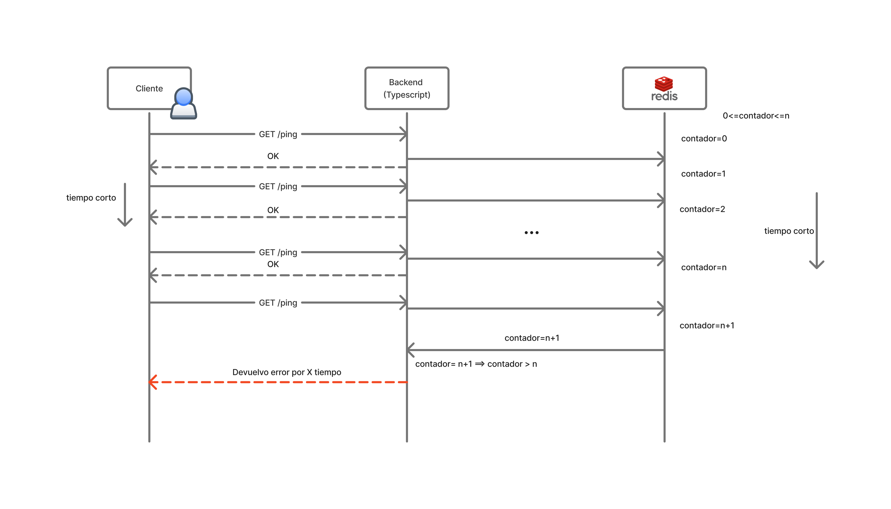

# DESIGN.md — IOL Rate Limiter

This document records the **architecture** and the **locked trade-offs** behind this rate
limiter, plus an honest account of **how AI was used** to build it. It narrates decisions that
were made and validated during development — it is not a fresh re-derivation.

The implementation is the rate limiter from *System Design Interview — An Insider's Guide, Vol 1*
(Alex Xu, Ch. 4): a framework-agnostic core (three algorithms behind one interface), a pluggable
store tier (an in-memory reference store and a distributed Redis store using atomic Lua), an
Express middleware adapter, and a small demo server that wires it all together.

---

## 1. Architecture overview

The system is **layered**, and the layering is enforced by a strict **tier boundary**:

```
demo/server.ts          composition root — the ONLY module that imports both
   │                    the core barrel AND the Express adapter
   ├─ rate-limiter/express   →  rateLimit({ limiter })   (Express adapter tier)
   │                              the ONLY tier that imports Express
   └─ rate-limiter (core barrel)
         ├─ TokenBucketLimiter / SlidingWindowLimiter / FixedWindowLimiter
         └─ Store
              ├─ MemoryStore   (in-memory reference, event-loop atomic)
              └─ RedisStore    (distributed, atomic Lua)  → the ONLY file that
                                                            imports ioredis
```

The **core barrel** (`src/index.ts`) exports the three limiters, both stores, and the
`SystemClock`. It is **framework- and transport-agnostic**: it imports neither Express nor
ioredis. Concretely:

- **Only `src/store/redis.ts` imports `ioredis`.** Everything else — the limiter math, the
  in-memory store, the types — has no knowledge of Redis.
- **Only `src/adapters/express/**` imports Express.** The core never sees a `Request` or a
  `Response`.
- **The demo server (`src/demo/server.ts`) is a new top tier** that may import both (Express via
  the `rate-limiter/express` subpath, the stores/limiters via the core barrel). It is the
  *composition root* — it reads the environment, builds a store and a limiter, and mounts the
  middleware. Nothing from the demo is added to `src/index.ts`.

This boundary keeps each algorithm unit-testable without a network or an HTTP framework, lets the
Redis client be swapped or mocked at exactly one seam, and makes the dependency graph legible — a
reviewer can read the core without ever touching Express or ioredis.

A `Decision` (`{ allowed, limit, remaining, resetMs, retryAfterMs }`) is the single value that
crosses the limiter → adapter boundary. All time fields are **integer milliseconds**; the
conversion to HTTP delta-seconds happens in exactly one place (see §6).

### Request flow (sequence diagram)



This is the author's own **hand-drawn** sequence diagram of the request path (its labels are in
**Spanish**). A client issues `GET /ping`; the backend (TypeScript) increments a **per-window
counter** in Redis (`contador` = 0, 1, 2, …). While the counter is within the limit
(`0 ≤ contador ≤ n`) the backend returns **200/OK**; once the counter exceeds the limit
(`contador = n + 1 ⇒ contador > n`) it returns **429** with `Retry-After` for the remainder of the
window — the red dashed arrow ("devuelvo error por X tiempo"). It is the human-authored companion to
the Mermaid request-path diagram in the README, making the per-window counter / 200→429 story
tangible.

---

## 2. Why atomic Lua (no round-trip races)

A naive distributed limiter does *read counter → check → increment → write* as separate Redis
commands. Between the read and the write, another client can read the same value, and both admit
a request that should have been rejected — a classic read-modify-write race that becomes worse
under load, which is exactly when a limiter matters.

The fix: each algorithm's entire state mutation runs **inside a single Lua script**, executed
server-side as one atomic unit. Redis is single-threaded for script execution, so concurrent
clients are **serialized by Redis itself** — there is no window between read and write.

Specifics of the implementation (`src/store/redis.ts` + `src/store/lua/*.lua`):

- **One Lua script per algorithm** — `token-bucket.lua`, `sliding-window.lua`,
  `fixed-window.lua` — registered via ioredis `defineCommand`. `defineCommand` gives automatic
  **EVALSHA caching with a NOSCRIPT fallback to EVAL**, so the script body is sent over the wire
  once and addressed by hash thereafter.
- **`now` is passed as ARGV**, never read inside the script with `redis.call('TIME')`. The clock
  lives on the caller side (and is injectable, which is what makes the algorithm tests
  deterministic). This also keeps every node's notion of "now" consistent with the caller rather
  than per-Redis-call.
- **The TTL is set inside the script**, so counters expire on their own and the keyspace never
  grows unbounded.
- **Keys are namespaced** (default prefix `rl`), so limiter state never collides with other data
  in the same Redis.

The in-memory `MemoryStore` achieves the same atomicity differently — see §4.

---

## 3. Fixed-window boundary burst (a documented trade-off, not a bug)

The **Fixed Window Counter** is included precisely so the trade-off space is visible. It is the
simplest algorithm — one counter per fixed clock window — but it has a known weakness: a client
can send up to `limit` requests at the very **end** of one window and another `limit` at the very
**start** of the next, producing up to **~2× `limit`** requests across the window boundary in a
short span.

**Worked example** (limit = 5, window = 60 s):

```
window A:  ...........  [ 5 requests at t = 59s ]   → all allowed (counter 0→5)
                        ── boundary at t = 60s ──
window B:  [ 5 requests at t = 61s ]  ...........   → all allowed (counter resets 0→5)

10 requests in ~2 seconds, while the intended rate was 5 per 60 s.
```

This burst is **intentional and documented** — it is the price of the algorithm's simplicity, and
keeping it (rather than papering over it) is what makes Fixed Window a useful point of comparison.

The **Sliding Window Counter** is the answer to this weakness: instead of a hard reset, it
estimates the current rate as a **weighted blend** of the previous and current window counts
based on how far into the current window the request falls. That smooths the boundary so a client
cannot double up across it, at the cost of a slightly more involved calculation. **Token Bucket**
(the demo default) avoids the boundary problem entirely by refilling continuously rather than
resetting on a clock edge.

---

## 4. Concurrency justification

The core value of this project is **correctness under concurrency**. Both stores provide the same
guarantee — *a burst of N concurrent requests admits exactly `limit` of them* — by two different
mechanisms:

**MemoryStore (single node).** Each store operation is **one synchronous read-modify-write**. Node
runs JavaScript on a single thread with a run-to-completion event loop, so a synchronous
read-modify-write **cannot be interleaved** with another — there is no preemption mid-operation
and therefore **no mutex is needed**. A `Promise.all` burst of overlapping requests is admitted
exactly up to `limit` (the over-admission guard), proven by the concurrency tests. Fractional
token state stays inside the store; the op boundary exposes only integer-millisecond values.

**RedisStore (distributed).** Across multiple processes/nodes the event loop no longer protects
us — but the **single Lua script per op** does. Redis serializes script execution, so the same
"exactly `limit` admitted" guarantee holds across clients (proven by the Redis concurrency tests
running against a real Redis via testcontainers). This is the distributed analog of the in-memory
event-loop atomicity: one mechanism (the event loop) on a single node, another (atomic Lua) across
nodes, **same observable guarantee**.

---

## 5. Fail-open vs fail-closed (availability vs strictness)

When the store itself is unavailable (Redis is down, slow, or timing out), the limiter must decide
whether to **admit** the request (fail-open) or **reject** it (fail-closed).

**The default is fail-open.** A rate limiter is a *protective* component; it must not become a
single point of failure that takes down the API it is meant to protect. If Redis is down, dropping
every request would convert a dependency outage into a full outage. This follows Xu Ch. 4 and
common industry practice: **availability over strictness by default**, configurable to fail-closed
for the rare endpoint where over-admission is worse than rejection.

This is backed by two defensive mechanisms in `RedisStore` so a flaky store can never **crash or
hang** the caller:

1. **A bounded per-call command timeout** (default **75 ms**, in the 50–100 ms band). Every Redis
   round-trip is time-boxed, so a slow Redis fails fast into the policy rather than blocking the
   request.
2. **A circuit breaker** (default: open after **5** consecutive failures, **2 s** cooldown, then a
   half-open probe). During an outage the breaker short-circuits so requests don't pile up waiting
   on timeouts — the policy is applied immediately. Every error path resolves through the
   fail-open/closed policy; `RedisStore` **never rejects** on the operation path.

### Degradation strategies considered (and why they were rejected)

This judgment call is graded, so the alternatives that were weighed and **deliberately not** taken
are recorded here:

| Strategy | Verdict | Why |
|----------|---------|-----|
| **Fail-open** (chosen default) | **Adopted** | Don't let the limiter take down the protected API; the standard default. |
| **Fail-closed** (configurable) | **Supported, opt-in** | Right for the rare endpoint where over-admission is worse than rejection. |
| **Per-node local `MemoryStore` on Redis failure** | Rejected | Each node would count independently → over-admission ≈ N× across N nodes, which **breaks the distributed correctness** that is the whole point of the Redis store. |
| **Postgres (or other DB) as a secondary store** | Rejected | Would mean re-implementing the algorithms in SQL and maintaining two implementations that **diverge under failover**; high complexity for a fallback path. |
| **Token leasing / pre-allocating budget to nodes** | Rejected | Real technique, but **overengineering** for this scope — adds coordination and a whole new failure mode. |
| **HA Redis (replica + Sentinel / cluster)** | Out of scope (the real prod answer) | This is the production-grade availability fix, but it is **infrastructure, not application code** — orthogonal to the library's behavior and out of scope for this deliverable. |

---

## 6. Delta-seconds reset-header convention

All time-related response headers are expressed in **delta-seconds** (seconds-from-now), **never**
as absolute epoch timestamps. The conversion from the `Decision`'s integer-millisecond fields to
seconds happens in exactly **one place** (`toSeconds = ceil(ms / 1000)` in the adapter), so there
is no second wall-clock read and no unit drift:

- `Retry-After = ceil(retryAfterMs / 1000)` — and **clamped to ≥ 1** on a `429`, because a `429`
  that says "retry after 0 seconds" is a contract violation (RFC 9110 §10.2.3).
- The IETF `RateLimit` reset (`t=`) and the legacy `X-RateLimit-Reset` are **both delta-seconds**,
  for unit consistency across the two families.

**Both header families are emitted, on the allowed response AND the 429** (default `headers: "both"`):

- **IETF draft-11** (Structured Fields, List form):
  `RateLimit-Policy: default;q=<limit>` and `RateLimit: default;r=<remaining>;t=<reset-seconds>`.
  (The policy name is an unquoted `sf-token` — `default`, not `"default"` — so a strict parser
  accepts it. A `;w=<windowSeconds>` part is appended only when a window is supplied; the demo
  does not pass one.)
- **Legacy** `X-RateLimit-Limit` / `X-RateLimit-Remaining` / `X-RateLimit-Reset`.

`Retry-After` is set **only** on the 429 path; the budget headers are present on both paths so a
client always sees its current allowance.

---

## 7. The `npm run verify` gate — and why Docker is required

`npm run verify` is the mandatory build-green gate. It is:

```
npm run verify   ==   tsc --noEmit  &&  vitest run --coverage  &&  eslint .
```

That is, a **typecheck**, the **full test suite under a hard coverage gate**, and the **linter**.
The build itself is also exercised inside the suite (a build-smoke test runs a real `tsup` build).

The coverage gate (`vitest.config.ts`) enforces **≥ 95% on all four metrics** — lines, statements,
functions, branches — over the *testable logic only* (the limiters, both stores, `validate.ts`,
`clock.ts`, the Express adapter). The demo server, the barrels, and the `.lua` files are excluded:
the `.lua` scripts are exercised through the real-Redis conformance/integration suites, and
rolldown (the v8 remapper) cannot parse Lua. The current run measures 100% statements / 98.4%
branches / 100% functions / 100% lines. A regression below the gate fails the run non-zero, which is
what makes the gate mandatory.

**A running Docker daemon is a prerequisite for `npm run verify`.** The suite's
Redis-backed tests (integration, concurrency, conformance against real Redis, fault injection)
start an ephemeral `redis:7.4-alpine` via testcontainers and run **unconditionally** as part of
`verify`. The deployment story for this project is Docker-first, and the strongest gate is one that
always exercises the real distributed Redis path rather than silently skipping it.

> **Start Docker before running `npm run verify`.** Without a running daemon the testcontainers
> Redis tests cannot start a container. (A `RL_SKIP_DOCKER=1` escape hatch exists for CI lanes
> that legitimately have no Docker, but the intended local/reviewer flow is Docker-up.)

---

## 8. API docs (Swagger) and the final audit fixes

**Interactive docs.** The demo server serves **Swagger UI at `/docs`** (raw spec at
`/openapi.json`) so the 200→429 behavior and the full header contract are visible and try-able in a
browser — the part of this project most worth showing. The OpenAPI 3 document is a **hand-written,
typed TypeScript object** (`src/demo/openapi.ts`, a `OpenAPIV3.Document` from the types-only
`openapi-types`), **not** generated from JSDoc decorators or a codegen toolchain. That choice is
deliberate: for two endpoints, codegen machinery reads as AI-slop and hides what is actually served,
whereas a hand-authored object is line-by-line legible, `tsc` checks its shape at compile time, and
`openapi-types` ships nothing to the runtime image. The docs routes are registered in the
**unlimited zone** (alongside `/health`, before `app.use(rateLimit(...))`) because the Swagger UI
pulls many static assets — rate-limiting the docs page would break it. `swagger-ui-express` is a
**runtime** dependency (the Docker image runs `npm ci --omit=dev`, so a devDependency would
`MODULE_NOT_FOUND` `/docs` in the container).

**Final audit fixes (material only).** A skill-assisted re-audit was run before submission. Per the
"fix material findings only, record the rest" discipline, the acted-on findings were: a single
ESLint error (an unused test parameter) and two stale `eslint-disable` directives — both fixed — and
the decision to **add `lint` to the `verify` gate** now that `eslint .` exits 0, so the single green
gate covers typecheck, coverage, and lint. No working, tested code was refactored. The full
brief→evidence map and the complete audit-disposition table (including the one justified
`/* v8 ignore */` for a provably-unreachable sliding-window branch) are recorded in
[COMPLIANCE.md](./COMPLIANCE.md).

**Metrics (demo tier).** Metrics **are** now provided — at the **demo tier only**. The demo server
exposes a prom-client `/metrics` endpoint (`src/demo/metrics.ts` + the unlimited-zone route in
`src/demo/server.ts`), counting rate-limit decisions via
`rate_limiter_decisions_total{decision="allowed"|"blocked"}` alongside Node/process defaults, and
`docker compose up` brings up a **Prometheus + Grafana** stack (the `monitoring/` provisioning tree)
with a pre-provisioned "Allowed vs Blocked" dashboard. Crucially this leaks **no** observability
dependency into the core: `prom-client` lives only under `src/demo/**` (same tier rule that keeps
Express/`ioredis` out of the core), so the shippable library stays framework-agnostic. **Logging
remains v2-deferred** — the `DegradedLogger` hook is the seam where a structured logger would attach
(see COMPLIANCE.md).

---

## 9. How AI was used (honest disclosure)

This project was built **with AI assistance — specifically Claude Code, driven through a phased
"GSD" (Get-Shit-Done) workflow**: *research → discuss → plan → execute → verify*, one phase at a
time. The disclosure below is candid, not marketing; the `.planning/` directory in this repository
is the evidence trail.

**What the AI did:**

- Scaffolded the project (TypeScript/tsup/Vitest/ESLint config, the `package.json`, the Docker and
  Compose files) from the agreed stack.
- Ported the three rate-limiting algorithms into Redis Lua scripts and wrote the in-memory
  reference store.
- Wrote the test suites (unit, concurrency, the conformance harness that keeps the TS and Lua
  implementations in lock-step, and the testcontainers Redis integration tests).
- Wrote the Express adapter, the demo server, and this documentation.

**What was human-directed:**

- The **requirements and scope** (what to build, what to leave out — e.g. only three algorithms,
  no second framework adapter; metrics are provided only at the **demo tier**, never in the core).
- Every **locked design decision** — the algorithm set, the in-memory + Redis store split behind a
  single `Store` interface, atomic Lua, the fail-open default, the delta-seconds header
  convention, the tier boundary. These were decided and recorded **before** implementation in the
  per-phase `CONTEXT.md` files under `.planning/phases/`; the AI narrated and implemented them, it
  did not invent them.
- **Trade-off choices** (fail-open vs fail-closed, keeping the Fixed Window boundary burst as a
  teaching contrast, rejecting the degradation alternatives in §5).
- **Reviews and corrections** — AI output was read, checked against the requirements, and
  corrected throughout; the mandatory "code builds and all tests pass" gate (`npm run verify`) was
  the objective check on every phase.

**Evidence.** The `.planning/` tree records the phase-by-phase research, the discussion/decision
logs (`CONTEXT.md`), the plans, and the execution summaries. The decisions in this DESIGN.md trace
directly back to those files rather than being reconstructed after the fact.

---

## 10. Scope note (this is a demo, honestly scoped)

This is a **challenge deliverable and demo**, not a hardened production service, and the docs do
not claim otherwise:

- **No authentication** — the demo rate-limits by IP only; auth is out of scope.
- **Trust-proxy deployment note.** The middleware keys on `req.ip` and **never parses
  `X-Forwarded-For` itself**. Behind a reverse proxy or load balancer, correct per-IP limiting
  requires configuring Express's `trust proxy` so `req.ip` reflects the real client; otherwise all
  traffic appears to come from the proxy and shares one bucket (or a client can spoof
  `X-Forwarded-For`). The Compose demo runs the app directly (no proxy), so the default `req.ip`
  is correct as shipped.
- **Redis is not exposed on the host** in the Compose setup — it is reachable only on the internal
  network — and the runtime image runs as a **non-root** user with pinned base images.
