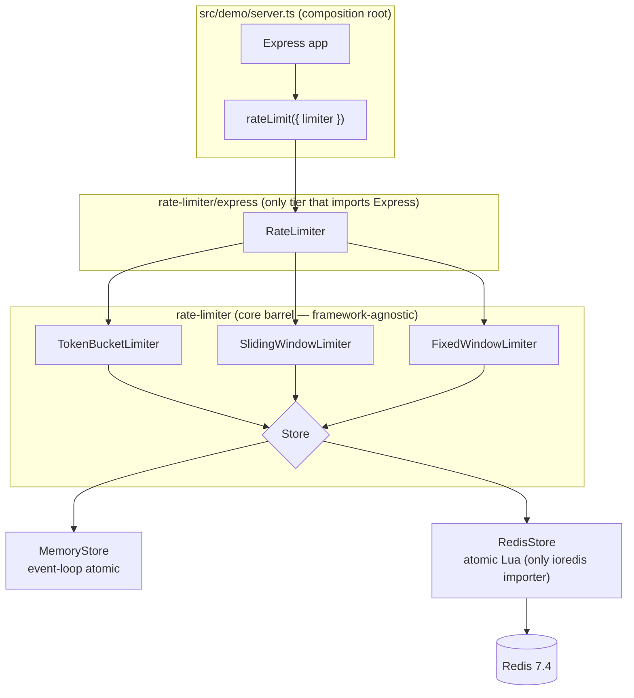
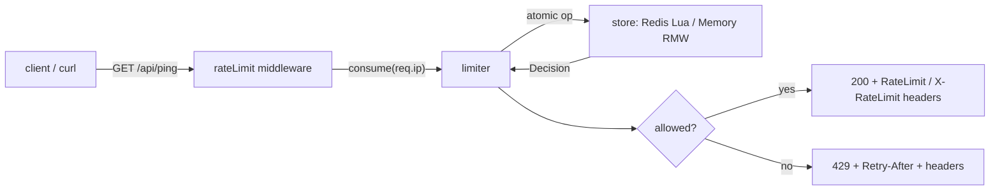

# IOL Rate Limiter

A distributed **rate limiter** in TypeScript/Node.js: a framework-agnostic core with three
algorithms (**Token Bucket**, **Sliding Window Counter**, **Fixed Window Counter**) behind one
interface, a pluggable store (in-memory reference **or** distributed **Redis** with atomic Lua),
an **Express** middleware adapter, and a demo HTTP server — deployable with one command via Docker.

> Design rationale, trade-offs, and the AI-usage disclosure live in **[DESIGN.md](./DESIGN.md)**.

---

## Quickstart — one command

From this `rate-limiter/` directory:

```bash
docker compose up
```

That builds the app image, starts **Redis** (`redis:7.4-alpine`) with a healthcheck, waits for it
to be healthy, and runs the demo against the **real distributed Redis path**. The app then listens
on **http://localhost:3000**.

Two routes:

- `GET /api/ping` — **rate-limited** (returns `{ "pong": true }` until the limit is hit).
- `GET /health` — **not** rate-limited (returns `{ "status": "ok" }`; used as the container
  healthcheck).

The demo limit is intentionally tiny (**5 requests per 60 s**, Token Bucket by default) so a `429`
is trivial to reproduce.

---

## Try it: a 200, then a 429

```bash
# 1) A single allowed request — 200 with both rate-limit header families.
curl -i http://localhost:3000/api/ping
#   HTTP/1.1 200 OK
#   RateLimit-Policy: default;q=5
#   RateLimit: default;r=4;t=60
#   X-RateLimit-Limit: 5
#   X-RateLimit-Remaining: 4
#   X-RateLimit-Reset: 60
#   {"pong":true}

# 2) Trip the limit: fire 6 quickly. The bucket holds 5, so the 6th is throttled.
for i in $(seq 1 6); do
  curl -s -o /dev/null -w "%{http_code}\n" http://localhost:3000/api/ping
done
#   200
#   200
#   200
#   200
#   200
#   429

# 3) Show the throttled response — 429 with Retry-After and the JSON body.
curl -i http://localhost:3000/api/ping
#   HTTP/1.1 429 Too Many Requests
#   Retry-After: 60
#   RateLimit: default;r=0;t=60
#   X-RateLimit-Remaining: 0
#   {"error":"Too Many Requests","retryAfterMs":60000}
```

Both header families (IETF `RateLimit` / `RateLimit-Policy` and legacy `X-RateLimit-*`) are emitted
on **both** the allowed and the throttled response. All reset/retry values are **delta-seconds**
(seconds from now), not epoch timestamps, and `Retry-After` is clamped to at least `1` on a `429`.

### Interactive API docs (`/docs`)

The running demo serves interactive **Swagger UI** at
[`http://localhost:3000/docs`](http://localhost:3000/docs) (raw spec at
`http://localhost:3000/openapi.json`). It documents both routes including the
`200`/`429` responses and the full `RateLimit` / `X-RateLimit-*` / `Retry-After`
header set, so the 200→429 semantics are visible and try-able in the browser. The
OpenAPI spec is **hand-written** (`src/demo/openapi.ts`, no codegen) and the docs
routes are registered outside the limiter so the UI's static assets are never
throttled.

---

## Configuration

The demo is configured entirely through environment variables (read once at startup; an invalid
`RL_ALGO`, or a present-but-non-numeric `RL_LIMIT` / `RL_WINDOW_MS` / `RL_REFILL`, fails loud with
an error at startup):

| Env var        | Default          | Effect                                                                                          |
|----------------|------------------|-------------------------------------------------------------------------------------------------|
| `REDIS_URL`    | *(unset)*        | When set, uses the distributed **`RedisStore`** at that URL. When **unset**, falls back to the in-memory **`MemoryStore`** — so the demo runs with **zero Docker**. |
| `RL_ALGO`      | `token-bucket`   | Which algorithm to enforce: `token-bucket` \| `sliding-window` \| `fixed-window`.                |
| `RL_LIMIT`     | `5`              | Allowed budget per window. Token Bucket: `capacity`. Sliding/Fixed Window: `limit`.             |
| `RL_WINDOW_MS` | `60000`          | Refill interval / window length in ms. Token Bucket: `intervalMs`. Sliding/Fixed Window: `windowMs`. |
| `RL_REFILL`    | `= RL_LIMIT`     | **Token Bucket only:** tokens refilled per interval (`refillPerInterval`). Ignored by the window algorithms. |
| `PORT`         | `3000`           | HTTP listen port.                                                                               |

Override the limit/window at run time without rebuilding, e.g.:

```bash
docker run -e RL_LIMIT=10 -e RL_WINDOW_MS=10000 <image>
```

The same vars can be edited in the `app.environment` block of `docker-compose.yml`.

Under `docker compose up`, Compose sets `REDIS_URL=redis://redis:6379` (the real distributed path),
`RL_ALGO=token-bucket`, and the tunable `RL_LIMIT` / `RL_WINDOW_MS` / `RL_REFILL` defaults.

### Run standalone, without Docker

Because an unset `REDIS_URL` falls back to the in-memory store, you can run the demo with no Redis
and no Docker at all:

```bash
npm install
npm run dev                         # tsx watch — no build step
# or, the built path:
npm run build && npm start          # node dist/demo/server.js
```

Then hit `http://localhost:3000/api/ping` exactly as above.

---

## Verify (a running Docker daemon is required)

```bash
npm run verify        # == tsc --noEmit && vitest run --coverage && eslint .
```

**Start Docker before running `npm run verify`.** `verify` runs a typecheck, the **full** test
suite under a coverage gate, and the linter. The Redis-backed tests start an ephemeral
`redis:7.4-alpine` container via testcontainers and run **unconditionally** — so a running Docker
daemon is a hard prerequisite. Without it those tests cannot start a container. (See
[DESIGN.md §7](./DESIGN.md) for why Docker is required rather than skipped.)

### Coverage

The suite enforces a **hard coverage gate** over the testable logic (the limiters, both stores,
`validate.ts`, `clock.ts`, and the Express adapter — the demo server, barrels, and `.lua` files are
excluded). All four metrics are gated at **≥ 95%** in `vitest.config.ts`; the current run measures
**100% statements / 98.4% branches / 100% functions / 100% lines** across **132 tests**. A
regression below the gate fails `npm run verify` non-zero.

A full brief→evidence compliance map and the audit dispositions live in
**[COMPLIANCE.md](./COMPLIANCE.md)**.

---

## Architecture

### Layered design



### Request path



---

## Deployment note (behind a proxy)

The middleware keys on `req.ip` and **never parses `X-Forwarded-For` itself**. Behind a reverse
proxy or load balancer, configure Express's [`trust proxy`](https://expressjs.com/en/guide/behind-proxies.html)
so `req.ip` reflects the real client — otherwise all traffic shares one bucket (or a client could
spoof the forwarded header). The Compose demo runs the app **directly** (no proxy), so the default
`req.ip` is correct as shipped.
